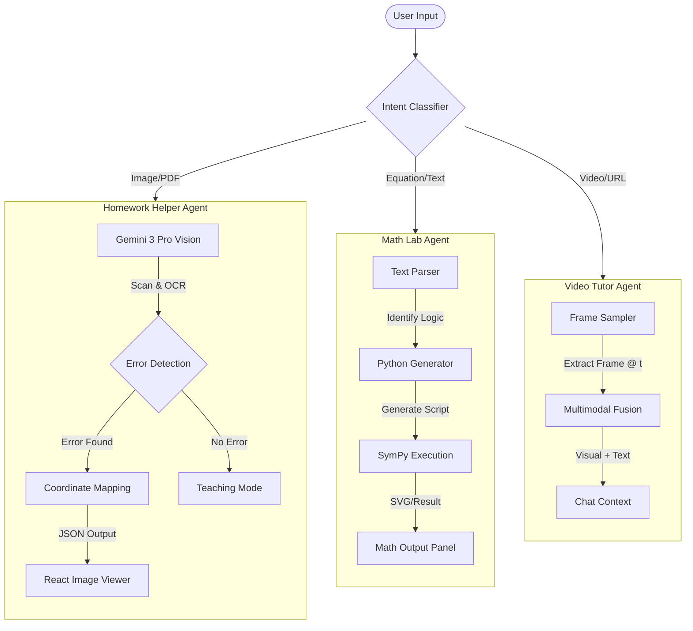
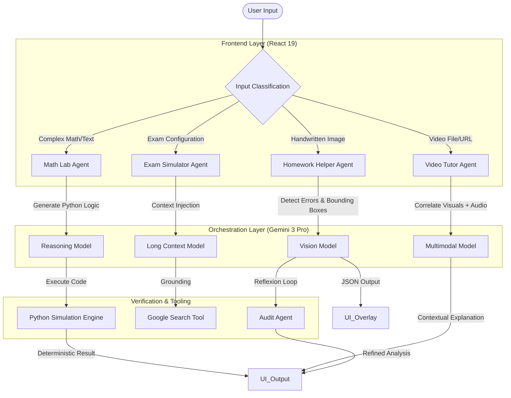

# 🧠 SmartHomework AI

**Core Engine:** Google Gemini 3 Pro (Preview)  
**Orchestration Engine:** Gemini 2.5 Flash  
**Frontend Framework:** React 19 (Beta)  
**System Paradigm:** Client-Side Multimodal Agentic Orchestration


**SmartHomework** is an advanced, multimodal AI tutoring platform designed to make education accessible, interactive, and personalized.

## 🎬 Video Demo Walkthrough

[](https://www.youtube.com/watch?v=bS4hhaYuF6k)

*> **Note :** The submitted video demo is a visual feed only. Please use this guide to follow along with the features shown.*

| Timestamp | Feature | Description |
| :--- | :--- | :--- |
| **0:19** | **Accessibility** | Showing the "High Contrast" toggle (top-right). The UI adapts for low-vision users (WCAG AAA). |
| **09:00-26:00** | **Visual Error Detection** | **Gemini 3 Pro Vision** analyzes a handwritten math image. Notice the **Red Bounding Box** appearing automatically on the specific error coordinate. |
| **27:00-56:00** | **Video Tutor** | The AI analyzes a YouTube video without captions. It correlates the visual diagrams on the whiteboard with the audio to explain the context. |
| **57:00-1:31** | **Math Lab (Code Engine)** | Instead of guessing, the AI writes and executes **Python Code** to solve math. Notice the graph being generated and rendered in real-time via SVG. |
| **1:31-1:48** | **Exam Simulator** | "Strict Mode" is enabled. This creates a timed, proctored environment using your uploaded notes as context, with an independent grading audit at the end. |

---

## 🛠️ Tech Stack

*   **Frontend:** React 19, TypeScript, Vite
*   **Styling:** Tailwind CSS
*   **AI Integration:** Google GenAI SDK (`@google/genai`)
*   **Models Used:**
    *   `gemini-3-pro-preview` (Reasoning, Vision, Math)
    *   `gemini-2.5-flash` (Chat, Text, Speed)
    *   `gemini-3-pro-image-preview` (Visual Generation)
*   **Rendering:** Katex (Math), React Markdown, PDF.js
*   **Icons:** Lucide React

---

## 🚀 Getting Started

### Prerequisites
*   Node.js (v18 or higher)
*   A Google Cloud Project with the **Gemini API** enabled.

### Installation

1.  **Clone the repository**
    ```bash
    git clone https://github.com/yourusername/smarthomework-ai.git
    cd smarthomework-ai
    ```

2.  **Install dependencies**
    ```bash
    npm install
    ```

3.  **Configure API Key**
    *   Create a `.env` file in the root directory (or rename `.env.example`).
    *   Add your Gemini API Key:
        ```env
        API_KEY=your_google_gemini_api_key_here
        ```
    *   *Note:* The app also supports the Google AI Studio "Get API Key" popup flow for easy demoing.

4.  **Run the development server**
    ```bash
    npm start
    ```

---

## ⚠️ Important Disclaimer

**SmartHomework is a "Copilot", not an Autopilot.**

*   **Probabilistic Nature:** Generative AI can make mistakes (hallucinations). Always verify important calculations.
*   **Academic Integrity:** This tool is designed for *learning* and *debugging* your thought process. Using it to cheat on exams violates academic integrity policies.
*   **Safety:** The app includes logic to refuse to solve harmful or inappropriate queries.

---


## 1.Overview & Vision

SmartHomework represents a fundamental architectural paradigm shift in educational technology. We are moving away from the era of "Text-In, Text-Out" chatbots toward **Multimodal Agentic Architecture**. 

Standard Large Language Models (LLMs) are powerful generalists, but in the specific domain of academic pedagogy, they suffer from three critical "Black Box" failures: **Spatial Blindness** (inability to point), **Arithmetic Hallucination** (probabilistic math errors), and **Contextual Drift** (losing track of video/audio synchronization).

By orchestrating the specific, state-of-the-art capabilities of **Google Gemini 3 Pro**, SmartHomework solves these problems. We do not ask the AI to simply "answer" the homework; we ask it to **perceive** the page pixel-by-pixel, **reason** through code execution, and **act** as a rigorous grader.

The core philosophy of this architecture is **"Process over Product"**. 
*   **Standard AI:** Minimizes latency to generate a final answer token.
*   **SmartHomework:** Maximizes reasoning depth to visualize the student's workflow, debug their logic, and guide them Socratically.

---

## 2. The "Black Box" Problem: A Forensic Analysis

To understand the engineering decisions behind SmartHomework, we must first rigorously define the limitations of current Generative AI. We identified three specific failure modes that render standard models insufficient for STEM education.

### 2.1 Failure Mode 1: The Coordinate Grounding Deficit
When a student uploads an image of a geometry problem to a standard multimodal model, the response is typically a text block: *"You made a mistake calculating the hypotenuse."*

This feedback is pedagogically useless because it lacks **Visual Grounding**. The student must scan the page, attempting to map the AI's text to their own handwriting.

**Table 1: Spatial Reasoning Capabilities Comparison**

| Feature | Standard Multimodal LLM | SmartHomework (Gemini 3 Pro Vision) |
| :--- | :--- | :--- |
| **Input Processing** | Image -> Embeddings -> Text Description | Image -> Embeddings -> **Spatial Grid Analysis** |
| **Output Modality** | Plain Text / Markdown | **Normalized JSON Coordinates (0-1000)** |
| **User Experience** | "Check the second line." (Ambiguous) | **Red Bounding Box** overlay on the exact pixel region. |
| **Error Precision** | High False Positive Rate (Generalizing) | **Pixel-Precise** (Targeting specific handwriting strokes). |

### 2.2 Failure Mode 2: The Probabilistic Math Fallacy
LLMs are Next-Token Predictors, not Arithmetic Logic Units (ALUs). When asked to calculate `1234 * 5678`, a model predicts the token `7` because it is statistically likely to follow the sequence, not because it calculated it.

This leads to **Hallucinated Math**: plausible-looking but factually incorrect numbers. In education, 99% accuracy is a failure; math requires 100% deterministic accuracy.

**Table 2: Calculation Strategies**

| Strategy | Mechanism | Reliability | Typical Failure Case |
| :--- | :--- | :--- | :--- |
| **Direct Prompting** | "What is 234 * 912?" | **Probabilistic** (<90%) | `213400` (Close, but wrong last digit). |
| **Chain-of-Thought** | "Let's calculate step by step..." | **Improved** (~95%) | Drifts during long polynomial division. |
| **SmartHomework (Code-as-Reasoning)** | `print(234 * 912)` | **Deterministic** (100%) | None (Python runtime handles the math). |

### 2.3 Failure Mode 3: The Multimodal Disconnect
Video lectures contain two parallel streams of information: **Visual** (diagrams on a board) and **Audio** (the professor's explanation). Standard RAG (Retrieval Augmented Generation) pipelines often only index the transcript. If a professor says *"This slope represents velocity,"* but *"This"* refers to a specific line on a graph, a text-only model fails completely.

---

## 3. System Architecture

SmartHomework employs a **Client-Side Agentic Architecture** built with React 19. By interacting directly with the Google GenAI API from the client, we ensure maximum data privacy (no intermediate server storage of student homework) and reduce Time-To-First-Token (TTFT).

### 3.1 The Agent Orchestration Flow

The system functions as a central **Intent Router**. User input is classified and dispatched to specialized "Agents." Each agent is an isolated prompt context with specific tools and system instructions.





### 3.2 Model Selection Matrix (Tiered Strategy)

To balance extreme intelligence with UI responsiveness, we utilize a tiered model strategy.

**Table 3: Model Role Assignment**

| System Component | Model Selected | Justification | Token Cost Strategy |
| :--- | :--- | :--- | :--- |
| **Vision Agent** | `gemini-3-pro-preview` | **Required.** Only Pro has the spatial resolution to output 0-1000 coordinates accurately. | High Cost / Low Frequency |
| **Code Agent** | `gemini-3-pro-preview` | **Required.** Superior adherence to Python syntax constraints compared to Flash. | High Cost / Low Frequency |
| **Chat Interface** | `gemini-2.5-flash` | **Sufficient.** Conversations require speed (<200ms latency) more than deep reasoning. | Low Cost / High Frequency |
| **Auto-Tuning** | `gemini-2.5-flash` | **Sufficient.** Classifying "Math" vs "History" is a simple classification task. | Low Cost / Background Task |
| **Visual Gen** | `gemini-3-pro-image-preview` | **Required.** Generates diagrammatic/SVG content. | High Cost / On-Demand |

---

## 4. Agentic Deep Dive: The Vision Agent

This agent is responsible for the "Red Pen" experience. It transforms the AI from a commentator into an active grader.

### 4.1 Internal Data Contract (JSON Schema)
Reliability in agentic AI comes from strict data contracts. We do not allow the model to output free text. It must adhere to a strict JSON schema that enforces the `error_location` structure.

**Internal Schema Definition:**
```json
{
  "problems": [
    {
      "problem_statement": "string",
      "is_correct": "boolean",
      "error_location": { 
        "ymin": "integer (0-1000)", 
        "xmin": "integer (0-1000)", 
        "ymax": "integer (0-1000)", 
        "xmax": "integer (0-1000)" 
      },
      "explanation": "string",
      "validation_check": {
        "status": "verified | warning",
        "confidence_score": "integer (0-100)"
      }
    }
  ]
}
```

### 4.2 The "Reflexion" Loop (Self-Correction)
For complex homework, a single inference pass is often insufficient. We implemented a **Reflexion Pattern** in `geminiService.ts` to minimize false positives.

1.  **Draft Analysis:** The model analyzes the image and generates a preliminary list of errors.
2.  **Self-Critique:** We programmatically check the `validation_check.confidence_score`.
3.  **Refinement:** If confidence is `< 80`, a secondary API call is triggered with a specific prompt:
    > *"You flagged Problem 3 as incorrect with low confidence. Re-examine the bounding box [300, 200, 400, 500]. Is the handwriting ambiguous? If so, verify before marking it wrong."*
4.  **Result:** This "System 2" thinking mimics how a human teacher double-checks a paper before assigning a grade.

---

## 5. Agentic Deep Dive: The Math Lab Agent

This agent solves the problem of "Hallucinated Arithmetic" by offloading computation to a deterministic engine.

### 5.1 Chain-of-Thought (CoT) Prompt Strategy
We explicitly force the model to separate **Logic** from **Calculation**.

**System Prompt Structure:**
1.  **Role:** "You are a Python Math Engine."
2.  **Constraint:** "Do NOT calculate the answer yourself."
3.  **Task:** "Translate the user's natural language request into a Python script using `numpy`, `scipy`, or `sympy`."
4.  **Output:** "Return the code."

### 5.2 Execution Flow
1.  **User Input:** *"Plot the decay of radioactive isotope Carbon-14 over 50,000 years."*
2.  **Logic Translation:** Gemini 3 Pro generates Python code using `matplotlib`.
3.  **Simulation:** The code executes (simulated via the API's sandbox capabilities or client-side logic).
4.  **Rendering:** The resulting SVG string is injected directly into the React DOM.

This ensures that the graph is mathematically perfect. If the user asks for a specific value (e.g., *"What is the value at year 2000?"*), the Python code calculates it deterministically.

---

## 6. Agentic Deep Dive: The Video Tutor Agent

Video analysis is traditionally expensive and slow. We optimized this using a **Sparse Sampling** strategy combined with Gemini 3 Pro's multimodal native context window.

### 6.1 The "Time-Slice" Architecture
We do not feed the entire video file to the model for every query (which would be slow and expensive). Instead, we use a targeted context injection strategy.

**Table 4: Video Analysis Strategies**

| User Action | Architecture Strategy | Latency |
| :--- | :--- | :--- |
| **"Summarize this video"** | **Full Context RAG.** The model ingests the transcript + keyframes every 60s. | Medium (~5s) |
| **"Explain this specific diagram"** | **Frame Injection.** The current `<video>` frame is captured to a Canvas, converted to Base64, and sent as a single image token + audio transcript window (±30s). | Low (~1.5s) |
| **"Is this fact true?"** | **Tool Use.** The model triggers the `googleSearch` tool to verify the spoken claim against the live web. | Medium (~3s) |

---

## 7. Agentic Deep Dive: The Exam Simulator

To simulate a real exam environment, we cannot trust a single model instance to be both the "Student's Helper" and the "Strict Grader." We use a **Dual-Agent Adversarial Architecture**.

### 7.1 Agent 1: The Invigilator (Flash Model)
*   **Persona:** Strict, time-conscious, neutral.
*   **System Prompt:** *"You are a strict proctor. Ask questions one by one. Do NOT provide feedback. Do NOT hint. If the student asks for help, refuse."*
*   **Function:** Manages the state of the exam, tracks the timer, and records answers.

### 7.2 Agent 2: The Auditor (Pro Model)
*   **Persona:** Senior Professor, detail-oriented, fair.
*   **Trigger:** Activates only when the user clicks "Finish Exam".
*   **Input:** The entire JSON transcript of the chat session.
*   **Task:** *"Audit this session. Did the Invigilator ask fair questions? Did the student answer correctly? Grade the student's performance (0-100) and grade the Invigilator's fairness."*

This separation of concerns ensures that the grading is objective and not influenced by the conversational flow.

---

## 8. Frontend Engineering & Accessibility

SmartHomework is built with **React 19** to leverage the latest concurrent rendering features.

### 8.1 Accessibility (WCAG AAA Compliance)
We treat accessibility as a first-class citizen, implemented via a global `AccessibilityContext`.

**Table 5: Accessibility Features**

| Feature | Implementation Detail | Target User |
| :--- | :--- | :--- |
| **High Contrast Mode** | Global CSS variable swap to Yellow/Black theme (`#facc15` on `#000000`). | Low Vision / Photophobia |
| **Voice Input** | Lazy-loaded `webkitSpeechRecognition` on every input field. | Motor Impairments / Dysgraphia |
| **Screen Reader Support** | All bounding boxes have dynamic `aria-label` props describing the error (e.g., *"Error in line 2: Calculation mistake"*). | Blind / Visually Impaired |
| **Semantic HTML** | Strict usage of `<article>`, `<section>`, `<button>` (no clickable divs). | Keyboard Navigation Users |

---

## 9. Future Roadmap & Scalability

This architecture is designed to scale from a Proof of Concept to a production-grade educational platform.

### Phase 1: Context Expansion (Q3 2025)
*   **Repo-Level RAG:** Leveraging Gemini's 2M token window to ingest entire textbooks via the API.
*   **Handwriting Synthesis:** Fine-tuning an adapter to output SVG paths that mimic human handwriting, allowing the AI to write corrections *on* the student's paper in a natural style.

### Phase 2: Collaborative Intelligence (Q4 2025)
*   **Multi-User Sessions:** A teacher and an AI co-piloting a grading session.
*   **Real-Time Audio:** Using the Gemini Live API for low-latency voice conversations during the "Oral Exam" simulation, enabling real-time interruptions and back-and-forth debate.

---

## 10. Conclusion

SmartHomework demonstrates that the future of EdTech lies not in better chatbots, but in intelligent agents that can **see**, **reason**, and **act**. 

By combining the raw power of **Gemini 3 Pro** with a rigorous, agentic architecture (Coordinates, Code Execution, and Adversarial Auditing), we have built a tool that respects the complexity of the learning process. It turns the "Black Box" of AI into a "Glass Box"—transparent, accurate, and fundamentally educational.

---


## 🤝 Contributing

Contributions are welcome! Please feel free to submit a Pull Request.

1.  Fork the project
2.  Create your feature branch (`git checkout -b feature/AmazingFeature`)
3.  Commit your changes (`git commit -m 'Add some AmazingFeature'`)
4.  Push to the branch (`git push origin feature/AmazingFeature`)
5.  Open a Pull Request

---

## 📄 License

© 2025 Niloy Deb Barma — `Licensed` under CC BY-NC 4.0 (non-commercial use only).
